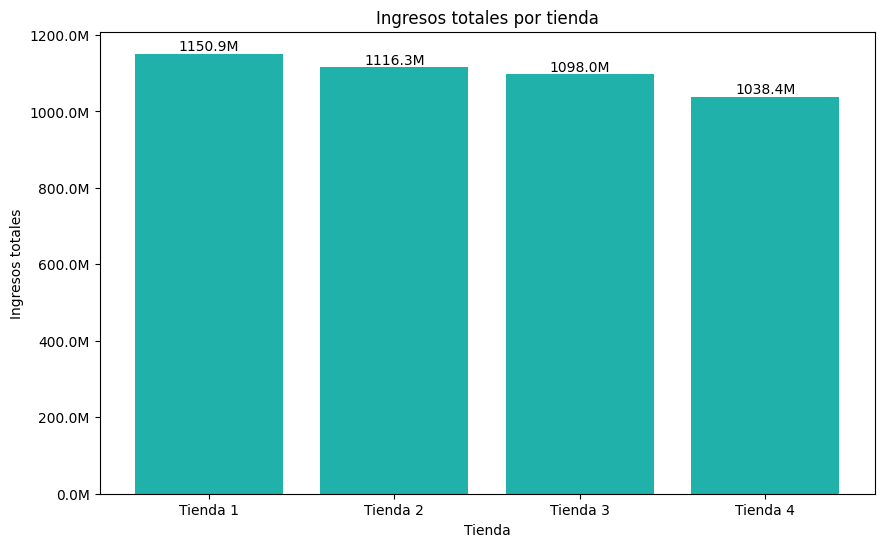
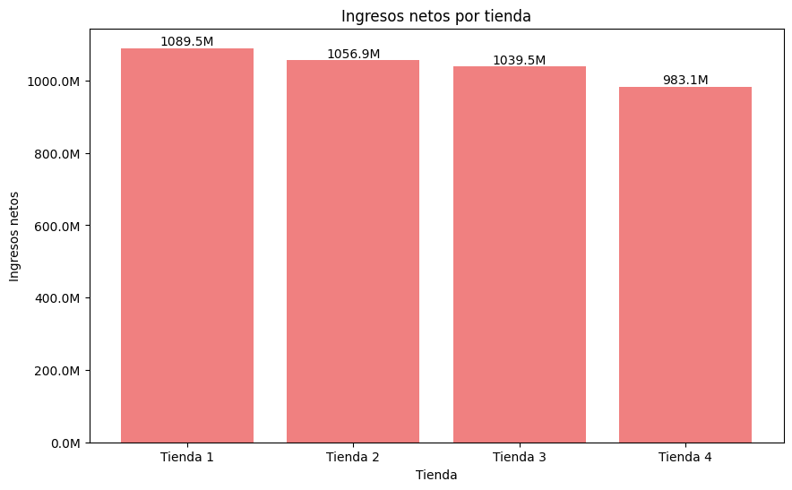

# 🛍️ Análisis de Ventas - AluraStore LATAM

Este proyecto explora los datos de ventas de cuatro tiendas en línea,  utilizando Python, pandas, y visualizaciones con seaborn y matplotlib. A través de gráficos e insights, se identifican patrones de comportamiento de clientes, productos más vendidos y tendencias por tienda.

---

## 📚 Índice

1. [📌 Propósito del Análisis](#-propósito-del-análisis)
2. [📁 Estructura del Proyecto](#-estructura-del-proyecto)
3. [📊 Ejemplos de Gráficos e Insights](#-ejemplos-de-gráficos-e-insights)
4. [⚙️ Instrucciones para Ejecutar la Notebook](#️-instrucciones-para-ejecutar-la-notebook)
5. [📌 Requisitos](#-requisitos)
6. [🧠 Créditos](#-créditos)
7. [📬 Contacto](#-contacto)

---

## 📌 Propósito del Análisis

El propósito de este análisis es:

- Explorar el rendimiento comercial de **AluraStore LATAM** en distintas tiendas.
- Identificar productos y categorías más relevantes en términos de ventas.
- Analizar el comportamiento de los usuarios, incluyendo cantidad de productos por pedido y ticket promedio.
- Brindar **insights accionables** para la toma de decisiones comerciales.

---

## 📁 Estructura del Proyecto

| Carpeta/Archivo               | Descripción                                                  |
|------------------------------|--------------------------------------------------------------|
| `AluraStoreLatam.ipynb`      | Notebook principal con el análisis exploratorio              |
| `images/`                    | Carpeta con gráficos exportados desde el notebook            |
| `README.md`                  | Archivo con documentación del proyecto                       |

---

## 📊 Ejemplos de Gráficos e Insights

### 📈 Ingresos Totales por Tienda



> **Insight:** Brasil representa el mayor volumen de ingresos, seguido por Argentina y México.

---

### 📉 Ingresos Netos por Tienda



> **Insight:** A pesar de diferencias de ingresos totales, los ingresos netos mantienen una proporción similar, lo cual puede indicar costos relativamente constantes entre regiones.

---

## ⚙️ Instrucciones para Ejecutar la Notebook

1. Cloná el repositorio:

```bash
git clone https://github.com/tu-usuario/alurastore-latam.git
cd alurastore-latam

