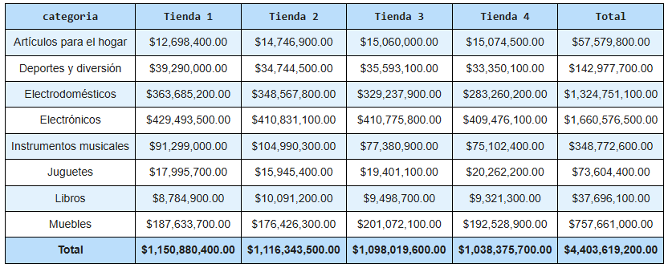
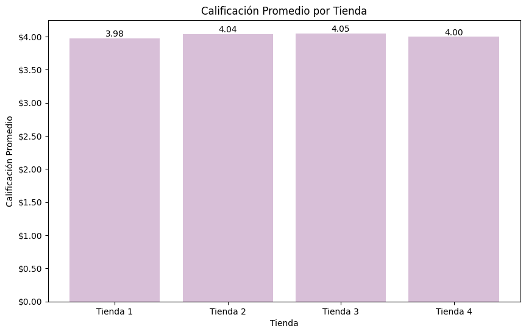
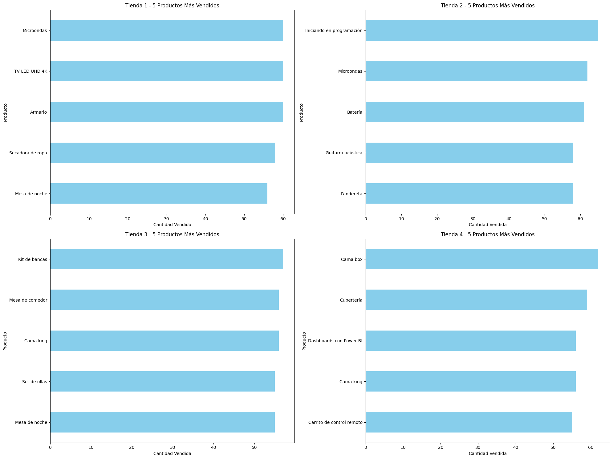
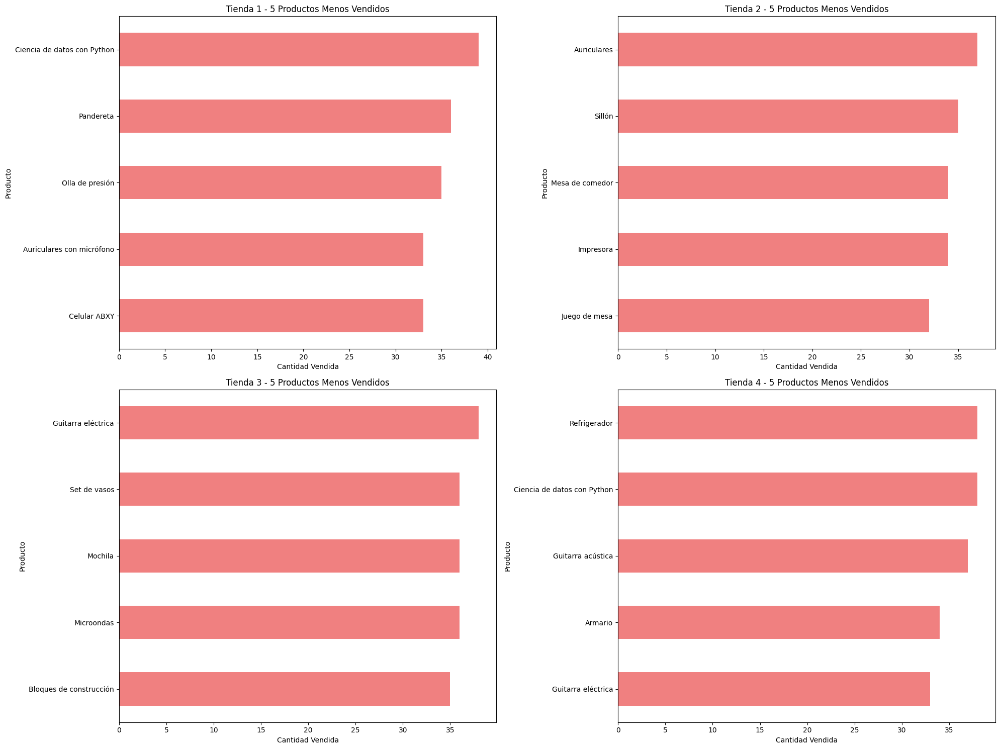
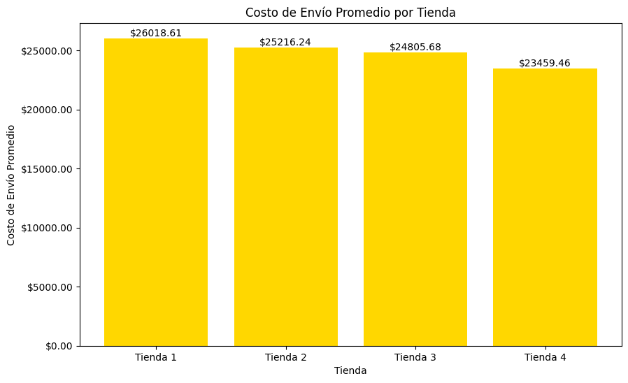

# 🛍️ Análisis de Ventas - AluraStore LATAM

Este proyecto explora los datos de ventas de cuatro tiendas en línea,  utilizando Python, pandas, y visualizaciones con seaborn y matplotlib. A través de gráficos e insights, se identifican patrones de comportamiento de clientes, productos más vendidos y tendencias por tienda.

---

## 📚 Índice

1. [📌 Propósito del Análisis](#-propósito-del-análisis)
2. [📁 Estructura del Proyecto](#-estructura-del-proyecto)
3. [📊 Ejemplos de Gráficos e Insights](#-ejemplos-de-gráficos-e-insights)
4. [⚙️ Instrucciones para Ejecutar la Notebook](#️-instrucciones-para-ejecutar-la-notebook)
5. [📌 Requisitos](#-requisitos)
6. [🧠 Créditos](#-créditos)
7. [📬 Contacto](#-contacto)

---

## 📌 Propósito del Análisis

El propósito de este análisis es:

- Explorar el rendimiento comercial de **AluraStore LATAM** en distintas tiendas.
- Identificar productos y categorías más relevantes en términos de ventas.
- Analizar el comportamiento de los usuarios, incluyendo cantidad de productos por pedido y ticket promedio.
- Brindar **insights accionables** para la toma de decisiones comerciales.

---

## 📁 Estructura del Proyecto

| Carpeta/Archivo               | Descripción                                                  |
|------------------------------|--------------------------------------------------------------|
| `AluraStoreLatam.ipynb`      | Notebook principal con el análisis exploratorio              |
| `images/`                    | Carpeta con gráficos exportados desde el notebook            |
| `README.md`                  | Archivo con documentación del proyecto                       |

---

## 📊 Ejemplos de Gráficos e Insights

### 📈 Ingresos Totales por Tienda

> **Insight:** La tienda 1 representa el mayor volumen de ingresos, seguido por la tienda 2 y 3.

---

### 📉 Ingresos Netos por Tienda

> **Insight:** A pesar de diferencias de ingresos totales, los ingresos netos, es decir contemplando los gastos en envíos, mantienen una proporción similar, lo cual puede indicar costos relativamente constantes entre las diferentes tiendas.

---

### 📉 Ingresos por categoría por Tienda

> **Insight:** Cuando se desagrega por categoría en todas las tiendas las ventas principalmente se dan en electrónica, seguido por electrodomésticos y muebles.

---
### 🥇🥈🥉 Calificación promedio de la tienda

> **Insight:** Aunque la tienda 1 es la que mayor ventas tiene, es la que peor calificación promedio tiene con 3.98. La tienda 3 es la que calificación promedio tiene con 4.05 puntos.

---

### 📊 5 productos más y menos vendidos por tienda

## Los cinco productos más vendidos

> **Insight:** Cuando se observan los productos más vendidos por tienda se observan ciertas diferencias, respecto a la facturación y a las principales categorás de facturación. De esta manera, los productos en la tienda 1 aparecen electrodomésticos (microondas, tv y secadora de ropa) y muebles (armario y mesa de noche), mientras que en le tienda 2 el principal producto que se vende es iniciando en programación, en la tienda 3 kit de sillas y en la tienda 4 cama box.

## Los cinco productos menos vendidos

> **Insight:** Cuando se observan los productos menos vendidos por tienda se observan nuevamente diferencias, el producto que menos se vende en la tienda 1 es Celular ABXY, en la tienda 2 juego de mesa, en la tienda 3 bloques de construcción y en la tienda 4 la guitarra eléctrica.
---

### 🚚 Costo de envío promedio por tienda

> **Insight:** El costo promedio de envío mayor se da en la tienda 1 con un monto de $26.018 y el menor en la tienda 4 $23.459.

---

## ⚙️ Instrucciones para Ejecutar la Notebook

Para ejecutar la notebook se debe clonar el repositorio

